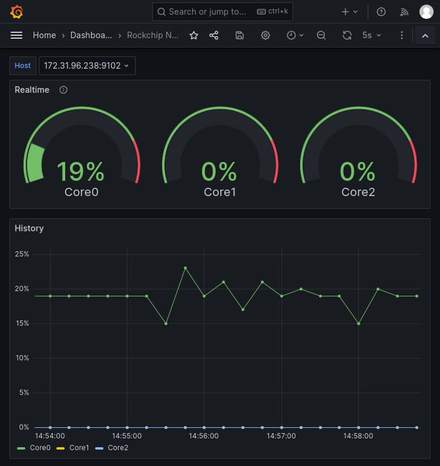

# RKNPU Exporter
[](https://github.com/yinguobing/rknpu-exporter/actions/workflows/rust.yml)

Prometheus exporter for Rockchip NPU load metrics, written in Rust.



## How it works
The Rockchip NPU load is available by this command:
```bash
sudo cat /sys/kernel/debug/rknpu/load
# output
NPU load:  Core0:  0%, Core1:  0%, Core2:  0%,
```
With a little help of [Rocket](https://rocket.rs/) and [client_rust](https://github.com/prometheus/client_rust), the load metrics could be parsed and exported for Prometheus.

## Prerequisites
To run the exporter natively:
- RK3588 SoC
- Debian 11

To develop:
- rustc 1.73.0 (cc66ad468 2023-10-03)


## Install
1. Download the executable binary file from the [Release](https://github.com/yinguobing/rknpu-exporter/releases) page and extract the content.

2. Create a configuration file named `Rocket.toml` in the same directory, and fill
it with your custom settings.
    ```toml
    # Example setup.
    [release]
    address = "0.0.0.0"
    port = 9102
    ```
    
That's all.

Notes

- > The exporter only makes the NPU load metrics available for scraping. 
A working stack of [Prometheus](https://prometheus.io/) and [Grafana](https://prometheus.io/docs/visualization/grafana/) is required for visual inspecting. 
Please refer to their official documents for installation.

- > For full configuration options: https://rocket.rs/v0.5-rc/guide/configuration/

## Run
In the directory where the binary file located
```bash
sudo ./rknpu-exporter
```

A message looks like `🚀 Rocket has launched from http://127.0.0.1:8000` will be printed, then the exporter is ready.

## Quick test
Open a browser and visit `127.0.0.1:9102/metrics`, you shall see the raw metrics.
```
# HELP rockchip_npu_load Rockchip NPU Load.
# TYPE rockchip_npu_load gauge
rockchip_npu_load{manufacturer="rockchip",device="npu",id="1"} 0
rockchip_npu_load{manufacturer="rockchip",device="npu",id="2"} 0
rockchip_npu_load{manufacturer="rockchip",device="npu",id="0"} 28
# EOF
```

If you are running the exporter in a remote machine, replace `127.0.0.1` with actual IP address.

## License
See [`LICENSE`](LICENSE) for more information.

## Authors
Yin Guobing (尹国冰) - [yinguobing](https://yinguobing.com/)

